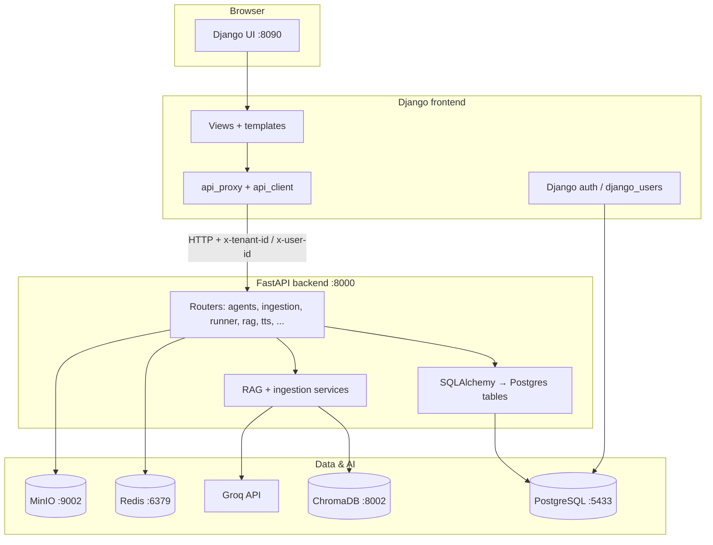
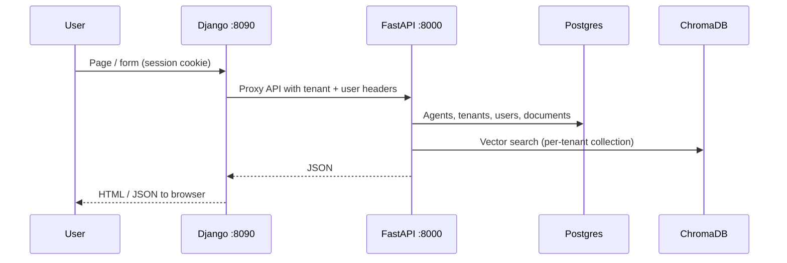

# VoiceFlow — Python stack

This folder contains the **full application**: a **Django** web UI, a **FastAPI** API and RAG backend, **Docker** services (Postgres, Redis, ChromaDB, MinIO), and an optional **TTS** container. Install dependencies from **`python/requirements.txt`** into a virtualenv (the Makefile uses **`..\.venv`** at the repo root).

---

## Quick start (every time you work)

### 1. Infrastructure (Docker)

From **`python/`** (or repo root with adjusted paths):

```powershell
cd D:\Projects\voiceflow\VoiceFlow\python
docker compose up -d postgres minio chroma redis
```

Optional: `tts-service` needs a GPU in `docker-compose.yml`; most local dev uses **Edge TTS** in the FastAPI app instead.

### 2. Virtual environment

```powershell
cd D:\Projects\voiceflow\VoiceFlow
Set-ExecutionPolicy -Scope Process -ExecutionPolicy Bypass -Force
.\.venv\Scripts\Activate.ps1
```

If dependencies changed:

```powershell
python -m pip install -r python\requirements.txt
```

### 3. Environment file

Copy **`python/.env.example`** → **`python/.env`** and set at least **`GROQ_API_KEY`**. Ensure **`BACKEND_API_URL=http://127.0.0.1:8000`** so the Django UI calls the correct API.

### 4. Django (first time or after model changes)

```powershell
cd D:\Projects\voiceflow\VoiceFlow\python\frontend
python manage.py migrate
```

### 5. Run the two servers (two terminals)

**Terminal A — FastAPI (port 8000):**

```powershell
cd D:\Projects\voiceflow\VoiceFlow\python\backend
python -m uvicorn main:app --host 127.0.0.1 --port 8000 --reload
```

**Terminal B — Django (port 8090):**

```powershell
cd D:\Projects\voiceflow\VoiceFlow\python\frontend
python manage.py runserver 8090
```

### 6. Open the app

| What | URL |
|------|-----|
| Web UI | http://127.0.0.1:8090 |
| API health | http://127.0.0.1:8000/health |

---

## Windows Makefile (optional)

If you use **`cmd.exe`** from **`python/`**:

- **`make init`** — one-time: venv at `..\.venv`, install deps, `.env`, Docker, migrate, seed hint  
- **`make docker`** — Postgres, MinIO, Chroma, Redis  
- **`make backend`** / **`make frontend`** — start servers (see `Makefile` for ports)

PowerShell users can follow the manual steps above; the Makefile targets **`cmd.exe`**.

---

## Architecture

### High-level diagram



### Request path (simplified)



---

## What each part does

### `frontend/` — Django

- **Purpose:** Server-rendered UI (landing, register/login, dashboard, onboarding, agent detail, chat), plus **browser-safe** proxies under `/api/...` that forward to FastAPI with CSRF and the logged-in user’s **`x-tenant-id`** / **`x-user-id`**.
- **Important files:**
  - `voiceflow/settings.py` — `BACKEND_API_URL`, DB for Django’s own tables
  - `core/api_client.py` — typed HTTP client to FastAPI
  - `core/views/api_proxy.py` — Django views that mirror API routes for same-origin `fetch`
  - `core/models.py` — `User` with `tenant_id` (table `django_users`); **not** the same ORM as FastAPI’s `users` table
  - `templates/` — Alpine.js + Tailwind (dashboard, onboarding, chat)

### `backend/` — FastAPI

- **Purpose:** REST API, **RAG** (retrieval + Groq chat), **ingestion** (Docling, embeddings, Chroma, BM25), **TTS** (Edge TTS and optional external service), voice/Twilio hooks, analytics, retraining scheduler.
- **Important files:**
  - `main.py` — app lifespan, CORS, router mounts, demo seed, rate limiting (Redis)
  - `app/models.py` — SQLAlchemy models (`tenants`, `users`, `agents`, `documents`, …) aligned with the product schema
  - `app/auth.py` — reads **`x-tenant-id`** / **`x-user-id`** (and optional email); **provisions** `tenants` + `users` rows when a Django user hits the API so foreign keys work
  - `app/routes/` — one module area per feature (`agents`, `ingestion`, `runner`, `rag`, …)
  - `app/services/ingestion_service.py`, `rag_service.py` — document pipeline and hybrid search

### `docker-compose.yml`

| Service | Port (host) | Role |
|---------|-------------|------|
| postgres | 5433 | Primary DB for FastAPI ORM; Django can use same or separate DSN per settings |
| redis | 6379 | Rate limits, chat/session helpers |
| chroma | 8002 | Vector store for RAG |
| minio | 9002 (API), 9003 (console) | Object storage for uploads / TTS artifacts |
| tts-service | 8003 | Optional GPU TTS in Docker |

### `requirements.txt` (this folder)

Single install list for **both** Django and FastAPI (FastAPI stack, ML/ingestion, OpenTelemetry pins for Chroma, etc.). From `python/frontend`, use `pip install -r ..\requirements.txt`.

### `tts-service/`

Separate **Docker**-oriented TTS server; local dev often relies on **`/api/tts`** in FastAPI (e.g. Edge TTS) without starting this container.

---

## How it works for end users

1. **Sign up / log in** on the Django site. Each user gets a **tenant id** (`tenant-<uuid>`) used on every API call.
2. **Onboarding** collects company info, creates an **agent** from a template, optionally uploads documents or URLs; the backend **ingests** content into **Chroma** (and related indexes) scoped to that tenant/agent.
3. **Dashboard** lists agents and metrics (data comes from FastAPI). Users open **agent detail**, **chat** (text/voice via proxied APIs), or **voice** flows where enabled.
4. **Chat** sends messages to **`/api/runner/chat`** (via Django **`/api/chat/`** proxy); the runner uses **RAG** over ingested knowledge and **Groq** for the reply. **TTS** can play responses back.
5. **Operators** can use analytics, call logs, retraining examples, settings (e.g. Groq/Twilio), and admin-style pages as implemented in the templates and routes.

In short: **Django owns the browser session and HTML**; **FastAPI owns business logic, AI, and the main Postgres schema**; **Chroma + MinIO + Redis** support search, files, and scaling concerns.

---

## Troubleshooting (short)

| Symptom | Check |
|---------|--------|
| Blank dashboard lists | Ensure list data is embedded as JSON (e.g. `json_script` in templates), not raw Python in JS. |
| Blank chat page | Chat template must extend **`base_dashboard.html`** (or any base that renders ``). |
| `relation "django_users" does not exist` | Run **`python manage.py migrate`** in `frontend/`. |
| Agent create FK error | Backend **`get_auth`** must create **`tenants`/`users`** rows for Django headers; ensure backend is current. |
| Chroma / ingest errors | Docker **`chroma`** up; **`GROQ_API_KEY`** set for LLM steps. |

---

## Related paths

- **`python/backend/requirements.txt`** and **`python/frontend/requirements.txt`** may list subsets; the canonical full stack is **`python/requirements.txt`**.
